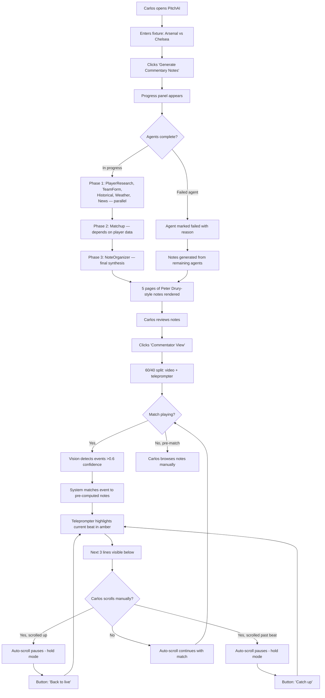
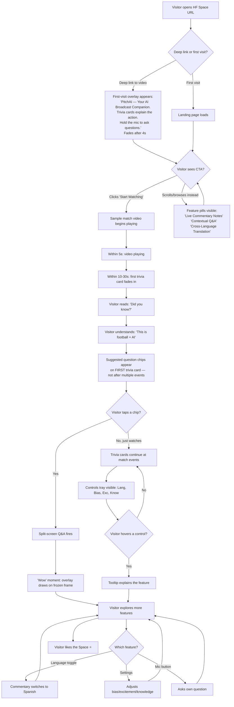

# UX Design Specification - PitchAI

**Author:** Deepu
**Date:** 2026-05-04

---

## Executive Summary

### Project Vision

PitchAI is a Proactive AI Broadcast Companion that transforms football viewing through three pillars sharing one vision backbone: Commentary Notes Engine, Contextual Stream Q&A, and Cross-Language Commentary. At its core, the product solves **temporal relevance** — surfacing the right information at the exact moment it matters, whether you're a first-time fan or a professional commentator.

One engine drives two renderings on a single laptop screen: a lightweight Fan Lens (5% corner trivia cards with visible mic button and settings tray) and a professional Commentator Dashboard (40% teleprompter with confidence-weighted, vision-synced highlighting). The product deploys as a single Hugging Face Space (Docker + React).

**Core principle:** The models attach to the stream; they don't hold it hostage. Video plays immediately on load — AI capabilities warm up in the background and attach when ready.

The demo is narrated and manually triggered — features are introduced progressively across a 5-minute escalating narrative. A landing page exists but is skipped during the demo video for pacing. The Community Visitor self-guided mode is architecturally distinct: no narrator, no pre-set timing, requiring the UX itself to guide strangers through all three pillars.

### Target Users

**Maria — The New Fan (Laptop)**
First-time football watcher. Learns passively through ambient trivia cards at key moments. Needs suggested questions surfaced proactively — she doesn't know what she doesn't know about football. Asks questions via audio when curious. Switches language for family. The system must educate without overwhelming; the match is always the priority. Controls (mic button, language toggle, settings) distributed across the laptop screen with clear affordances.

**Carlos — The Professional Commentator (Laptop)**
Prepares before broadcast. Generates pre-match notes via the 7-agent pipeline. During the match, scans the teleprompter in under a second while watching the action. Needs confidence indicators on stats (source, recency) — a wrong stat costs credibility on air. Handles surprise events (VAR, injuries) that the notes engine didn't pre-compute; the system must acknowledge uncertainty rather than confidently hallucinate.

**Community Visitor (Post-Demo, Self-Guided)**
Arrives at the HF Space outside the demo window. No narrator, no pre-set feature timing. Uses a sample match video with pre-generated notes. The UX must independently guide them through discovery of all three pillars. This is the hardest UX challenge — and the one that determines HF Prize likes.

### Key Design Challenges

1. **Dual-view on a single screen** — One engine, two radically different renderings (5% trivia overlay vs 40% teleprompter) sharing one laptop viewport. The Fan Lens must stay minimal and ephemeral. The Commentator Dashboard needs dense, scannable information. The toggle between views must feel intentional but effortless.

2. **Real-time AI latency perception** — Q&A < 3.5s, language switch < 3s, cold start < 20s. Language switch should queue/defer during high-intensity moments (never interrupt a celebration). Pre-load both languages so switching is a routing change, not a model load. Show recognized question text for 1.5s before answering — gives users a cancel window and fills the STT gap.

3. **Cognitive load during live match** — Football demands visual attention. Trivia cards must avoid the active play zone (ball position tracked by vision model). Cards fade over 400ms, display 5s, fade out. Split-screen Q&A must feel like curiosity's natural extension, not an interruption.

4. **Feature discovery without clutter** — Five features in five minutes on one laptop screen. Mic button is primary (always visible, bottom-right). Language toggle, bias slider, settings spatially distributed with clear affordances. "Demo provocation" — UI invitations at the right moment. Community Visitor mode has no narrator, so the UX alone must drive discovery.

5. **Handling the unexpected** — VAR, injuries, events not in pre-match notes. System must acknowledge uncertainty. Confidence-weighted teleprompter highlighting (don't highlight if below threshold). Source attribution on every stat. Honesty builds trust more than false certainty.

### Design Opportunities

1. **The "invisible" AI** — Trivia cards that feel like a knowledgeable companion whispering context. Video plays immediately; AI attaches when ready. The best AI moment is the one users don't consciously register as "AI."

2. **Temporal navigation as standout moment** — Split-screen scrub-back with AI-drawn overlays on canvas. Smooth execution here is the demo's headline beat and the Community Visitor's "wow" moment.

3. **Slider-to-sensation immediacy** — Bias, excitement, and knowledge depth sliders that transform the experience in real time. Slide it, hear the difference immediately. A compelling, judge-friendly demo beat.

4. **Progressive reveal as narrative** — The 5-minute escalating demo is itself a UX pattern. Features compose rather than compete. Community Visitor mode needs a different architecture: self-guided discovery without a narrator, using pre-seeded suggested questions and visible language toggle prompts.

5. **Confidence as a design material** — Show what the system knows and what it's unsure about. Confidence-weighted highlighting, ambiguity indicators on player identification, source attribution on stats. Transparency builds trust.

## Core User Experience

### Defining Experience

The core experience of PitchAI is **watching football with an intelligent companion**. The match video is the anchor — everything else (trivia cards, Q&A, teleprompter, settings) orbits around it. The user never leaves the video. Features layer on top of the stream, they don't navigate away from it.

**Jobs-to-be-Done framing:**

- **Maria** hires PitchAI to **feel like she understands football**. The trivia cards, suggested questions, and split-screen explanations are mechanisms — the real job is "Don't let me feel lost." Every feature must pass the test: does this make Maria feel smarter, or does it feel like an AI mansplaining football to her?
- **Carlos** hires PitchAI to **sound like he did hours of prep in 30 seconds**. The teleprompter, notes, and vision-triggered highlighting are mechanisms — the real job is "Make me sound like Peter Drury without Peter Drury's research team."

The experience progresses in three natural layers:
1. **Ambient** — Trivia cards surface autonomously at key match moments. The user learns without doing anything. Value before interaction.
2. **Reactive** — The user asks a question (hold mic, speak, release). The system answers with temporal grounding — split-screen showing the exact moment. Recognized text displayed for 1.5s as an emotional beat ("the AI heard me"), not a cold system prompt.
3. **Configurative** — The user adjusts commentary style (bias, excitement, knowledge depth) and language. Real-time transformation of the experience.

For the Commentator Dashboard, the core experience is different: **teleprompter as companion**. Notes scroll and highlight in sync with the match via vision-triggered narrative selection. The commentator scans, never searches.

### Platform Strategy

**Primary Platform:** Laptop web browser (desktop-class viewport, ~1440px+)
**Deployment:** Hugging Face Space (Docker + React frontend, FastAPI WebSocket backend)
**Input:** Mouse + keyboard primary; microphone via Browser Web Speech API with football terminology correction layer
**GPU Inference:** Separate AMD MI300X droplet, endpoint configurable via `VLLM_BASE_URL` Space secret
**No Offline:** Live streaming experience; requires network connection to both HF Space and GPU endpoint

**Key Platform Decisions:**
- Single viewport, no responsive breakpoints needed for hackathon scope
- Keyboard shortcuts for demo narration (quick-toggle between Fan Lens and Commentator Dashboard)
- Browser Speech API eliminates server-side STT latency — recognition happens locally
- Football terminology correction layer (simple string map) to fix common STT errors ("off side" → "offside", player name normalization)
- WebSocket auto-reconnect with exponential backoff; UI connection state indicator
- Vision model pre-warmed with initial frames before user sees video — ensures first trivia card can fire even at 15s
- All AI state managed via WebSocket; no page reloads, no SPA route changes

### Effortless Interactions

- **Video plays immediately** — Models warm up in background (vision model pre-warmed with initial frames) and attach to the stream when ready. Content is never blocked by AI loading.
- **Trivia surfaces without asking** — Vision detects match events, cross-references pre-computed notes, surfaces the right fact at the right moment. The fan learns without looking away.
- **Hold mic → speak → release** — One physical gesture for Q&A. Recognized text displayed for 1.5s as confirmation: styled as the AI leaning in and saying "I heard you," not a cold system prompt. Cancel button available. No typing, no menus, no mode-switching.
- **One click switches language** — Pre-loaded language models. Toggle is a routing change, not a model load. < 3s gap, < 500ms silence. If translation requires an LLM call, budget additional latency; if routing, it's near-instant.
- **Slider moves → experience transforms** — Bias, excitement, knowledge depth respond in real time. No "apply" button, no page refresh.

### Critical Success Moments

| Moment | Timing | Success Looks Like |
|--------|--------|--------------------|
| Cold start | First 5 seconds | Video playing. No spinner, no "loading model..." Vision model warming in background |
| First trivia card | ~10-30 seconds in | "Did you know?" — passive value before any interaction. Card fades in gracefully, not abruptly |
| First Q&A response | ~90 seconds in (demo) | Screen splits with a smooth slide animation. Overlay draws itself on. Answer grounded in the exact moment. Recognized text styled as emotional confirmation |
| Language switch | ~180 seconds in (demo) | Brief mute, resume in new language — meaning and emotion preserved. Transition feels like a crossfade, not a cut |
| Bias slider move | ~210 seconds in (demo) | Immediate tonal shift in next commentary line. No delay, no rebuffer |
| Community Visitor lands | Any time post-demo | Within 10 seconds: sees football playing + a trivia card appears. Understands "this is football + AI." First impression, not full comprehension. Tries a feature within 30 seconds |
| WebSocket drops | Any time | Auto-reconnect with exponential backoff. UI shows subtle connection indicator — not an alarm, not invisible |

### Experience Principles

1. **Video first, AI second** — Content is never blocked by model loading. The stream plays immediately; AI capabilities attach when ready (vision pre-warmed on initial frames). A spinning loader is a broken experience.

2. **Ambient before active** — Passive trivia cards prove value before the user does anything. The system demonstrates intelligence before the user has to ask for it.

3. **One gesture per action** — Hold-to-talk for Q&A. Click to toggle language. Slide to transform commentary style. No multi-step workflows, no modal dialogs, no confirmation buttons.

4. **Honesty over false certainty** — Show confidence indicators on player identification. Source attribution on every stat. Don't highlight teleprompter notes if confidence is below threshold. If temporal context is insufficient for a Q&A answer, indicate the limitation. Transparency builds more trust than pretending to be perfect.

5. **The match is always the priority** — Overlays are ephemeral (fade in 400ms, display 5s, fade out). Split-screen Q&A returns to full video when answer is complete. Nothing permanently reduces the match viewport.

6. **Every transition tells a story** — The split-screen slides in, doesn't cut. The overlay draws itself, doesn't pop. The trivia card fades in from nothing. Language switch crossfades, doesn't silence abruptly. Transitions ARE the experience. Jarring cuts break the magic, no matter how good the AI is.

## Desired Emotional Response

### Primary Emotional Goals

**Maria — "I belong here."**
The new fan arrives feeling excluded from the football conversation. Everyone around her reacts to something she doesn't understand. PitchAI's job is to transform that exclusion into belonging. Every trivia card, every Q&A answer, every suggested question should reinforce: "You're part of this now. You understand what's happening." The goal isn't to make Maria a football expert — it's to make her feel like she doesn't need to be one.

**Carlos — "I'm prepared. I sound brilliant."**
The commentator arrives feeling time pressure and the weight of expectation. He needs to deliver Peter Drury-quality calls without Peter Drury's research team. PitchAI's job is to transform that pressure into confidence. The teleprompter isn't a crutch — it's a co-pilot. When the right stat surfaces at the exact right moment, Carlos delivers it as if he knew it all along. The AI makes him more himself, not less.

**Community Visitor — "I need to try this."**
The self-guided visitor arrives with no context and no narrator. The emotional goal is curiosity → intrigue → action. Within 10 seconds they understand the concept. Within 30 seconds they try a feature. The emotion isn't "this is impressive technology" — it's "I want to show someone this."

### Emotional Journey Mapping

**Maria's Journey:**

| Stage | Emotion | What Creates It |
|-------|---------|-----------------|
| Arrival | Relief | Video plays immediately. No loading, no setup, no confusion |
| Passive discovery | Curiosity | First trivia card fades in. "Did you know?" She didn't, and now she does |
| First interaction | Safety | Suggested questions appear. She doesn't have to invent a question — she can pick one |
| Q&A response | Wonder | Screen splits. The moment replays. The overlay explains. "That's WHY it was a red card" |
| Language switch | Comfort | Her father can understand now. She doesn't have to translate for him |
| Return | Confidence | She comes back because she knows she'll understand. Football isn't intimidating anymore |

**Carlos' Journey:**

| Stage | Emotion | What Creates It |
|-------|---------|-----------------|
| Pre-match | Relief | 7-agent pipeline finishes. 5 pages of notes. "This would've taken me 3 hours" |
| Review | Trust | Stats have sources. Player profiles are detailed. He can verify if he wants to |
| Live broadcast | Flow | Teleprompter scrolls in sync. Current beat highlighted in gold. Next 3 lines visible |
| Surprise event | Reassurance | VAR decision. The system shows what it knows, acknowledges what it doesn't |
| Post-match | Pride | He delivered lines he wouldn't have thought of. The AI made him better, not redundant |

**Community Visitor's Journey:**

| Stage | Emotion | What Creates It |
|-------|---------|-----------------|
| Landing | Intrigue | Match is playing. A trivia card appears. "Football + AI. I get it." |
| Exploration | Curiosity | Visible controls invite interaction. Suggested questions prompt the mic |
| "Wow" moment | Delight | Split-screen Q&A works. Overlays draw on. "This is genuinely cool" |
| Sharing | Excitement | The README is clear. The Space is polished. "I want to show someone this. ⭐" |

### Micro-Emotions

**Critical to cultivate:**

- **Trust over skepticism** — Every stat has a source. Every player ID has a confidence indicator. The system says "I don't know" rather than guessing. Trust is earned one accurate fact at a time.
- **Curiosity over confusion** — When Maria doesn't understand something, the system anticipates her question. Suggested questions appear proactively. She never has to admit she doesn't know — the AI offers the question for her.
- **Delight over mere satisfaction** — Split-screen temporal navigation isn't just functional — it's magical. The overlay drawing itself on the exact moment. The language crossfade instead of a hard cut. These aren't features; they're moments of joy.
- **Belonging over isolation** — Maria watches with friends who already know football. Trivia cards give her things to say. Knowledge depth slider meets her where she is. She's part of the conversation, not watching from outside.

**Emotions to actively avoid:**

- **Overwhelm** — Too many cards, too fast. Cards are sparse (key moments only), 2-line max, fade after 5 seconds
- **Condescension** — Explaining basic rules to Carlos would be insulting. Explaining advanced tactics to Maria would be alienating. Knowledge depth slider prevents both
- **Interruption** — AI that pulls attention from the match. Cards avoid the active play zone. Split-screen returns to full video. The match is always the priority
- **Anxiety** — "Is this going to work?" Cold start is fast. WebSocket reconnects silently. Degraded modes are clearly indicated. The system never dies without explanation

### Design Implications

- **Trust → Source attribution on every stat.** Every trivia card and teleprompter line shows where the data came from (StatsBomb, Firecrawl, FBref). Recency indicator ("as of May 2026"). Confidence badge on player identification.
- **Curiosity → Suggested questions surfaced proactively.** "Why is that a yellow card?" appears when a card is shown. "Who is number 10?" appears when a player is on screen. The system anticipates what Maria wants to know before she has to ask.
- **Delight → Transitions are moments, not mechanics.** Split-screen slides in with easing. AI overlay draws line-by-line. Language switch crossfades. Trivia cards fade from 0 opacity. Every transition is designed, not default.
- **Belonging → Multiple entry points for knowledge.** Trivia for passive learners. Suggested Q&A for curious learners. Knowledge depth slider for varying expertise. Bias slider for emotional alignment. No single "right" way to engage.
- **Safety → Visible cancel and correction mechanisms.** Recognized text shown for 1.5s with cancel. Wrong stat attribution can be flagged (stretch). Nothing the AI says is presented as infallible.

### Emotional Design Principles

1. **Trust through transparency** — Never present AI output as fact without provenance. Show sources, confidence, and uncertainty. "I think this is number 10 based on the lineup" is better than confidently naming the wrong player.

2. **Curiosity through invitation, not instruction** — Don't tell the user what they should know. Offer them questions they might want to ask. Let them choose. The AI suggests; the user decides.

3. **Delight through craft, not gimmicks** — No confetti animations. No "AI magic!" marketing copy. The delight comes from a transition that feels impossibly smooth, an answer that arrived at the perfect moment, a language switch that felt like nothing happened.

4. **Belonging through meeting users where they are** — Knowledge depth slider. Bias slider. Suggested questions. Language toggle. Every user gets their own experience without configuring anything. The defaults work; the controls refine.

5. **Safety through graceful failure** — When the AI is uncertain, say so. When the WebSocket drops, reconnect silently. When a feature degrades, indicate the mode. The system should never surprise the user with a failure they don't understand.

## UX Pattern Analysis & Inspiration

### Inspiring Products Analysis

**Metrica Sports — Professional Football Analytics Platform**

Metrica Sports is the gold standard for football data visualization and analysis UX. Their core pattern is the **pitch as canvas** — a top-down or perspective view of the football pitch onto which data layers are overlaid: player positions as numbered circles, passing lines as weighted arrows, pressure zones as heat gradients, defensive blocks as filled polygons. Every overlay element is precise, minimal, and data-driven.

**Key UX patterns from Metrica:**
- **Pitch as primary canvas** — The football pitch IS the interface. Data doesn't sit in sidebars or tables; it's rendered directly on the spatial context where the action happens. This is directly transferable to PitchAI's AI-drawn overlays (offside lines, player highlights, movement arrows) during split-screen Q&A.
- **Frame-synced video + data** — Match footage plays alongside a 2D pitch view. Scrubbing the video updates the pitch view in real time. Every frame has corresponding spatial data. This is the temporal navigation pattern PitchAI uses for Q&A — the video IS the answer, annotated in place.
- **Professional density without clutter** — The interface serves professional analysts who need detailed information. Density is achieved through precise spatial placement, consistent color coding, and progressive disclosure rather than hiding information behind menus.
- **Confidence through precision** — Every data point is spatially exact. Player positions are tracked to centimeter-level accuracy. This creates an implicit trust: when data looks this precise, users trust it. PitchAI should emulate this precision aesthetic even when the underlying AI has uncertainty.

**Pavel Fernandez / Football Analytics — Tactical Split-Screen Visualizations**

The split-screen pattern demonstrates a compelling approach: match video on one side, tactical analysis or data visualization on the other, synced to the same moment in time. Both views update together as the analyst scrubs through key moments.

**Key UX patterns from the split-screen reference:**
- **Temporal synchronization** — Both sides of the split are anchored to the same timestamp. Scrubbing one side updates the other. PitchAI's split-screen Q&A works the same way: live match on the left, relevant historical moment with overlays on the right.
- **Visual explanation over textual** — The analysis side doesn't describe what happened — it shows it. Arrows, circles, and highlights do the explaining. Text is secondary, supporting the visual. PitchAI's overlay philosophy (AI-drawn circles, arrows, offside lines on canvas) follows this exact pattern.
- **Split as narrative device** — The split isn't a permanent layout. It's triggered by a question or an analytical moment, then resolves back to full video. The split itself tells a story: "Here's the live action, and here's WHY that happened." PitchAI's split-screen should follow the same momentary-then-resolve pattern.
- **Professional aesthetic** — Clean, dark backgrounds. High contrast overlays. Typography that doesn't compete with the visual data. The aesthetic signals "this is serious analysis" not "this is a consumer toy."

### Transferable UX Patterns

**From Metrica Sports:**

| Pattern | Metrica Implementation | PitchAI Adaptation |
|---------|----------------------|-------------------|
| Pitch as canvas | 2D top-down tactical view with player tracking dots, passing lines, heat zones | AI-drawn overlays on actual match video: circles around players, offside lines, movement arrows rendered on canvas |
| Frame-synced data | Video timeline synced to spatial data view, scrubbing updates both | Split-screen Q&A: left = live feed, right = relevant moment with overlays drawn on frozen frame |
| Professional density | Multiple data layers on single pitch view, distinguished by color/weight | Teleprompter dashboard: current beat + next 3 lines + confidence badges + source attribution, scannable in < 1 second |
| Precision aesthetic | Clean lines, exact positions, minimal chrome | Overlay elements rendered with clean SVG strokes, not sketchy/hand-drawn. Dark theme, high contrast |

**From Split-Screen Reference:**

| Pattern | Source Implementation | PitchAI Adaptation |
|---------|---------------------|-------------------|
| Temporal sync | Video + tactical view tied to same timestamp | Live match continues on left; right side scrubs to Q&A-relevant moment |
| Visual-first explanation | Arrows, circles, highlights as primary communication | AI draws annotations directly on the relevant frame; text answer is supplementary |
| Momentary split | Split triggers for analysis, resolves to full video | Split-screen appears for Q&A response (~5-8 seconds), then slides back to full video. Not a persistent layout |
| Dark professional aesthetic | Clean dark background, high-contrast overlays, minimal typography | Dark theme for overlays/controls. Commentary settings on dark translucent panels. No bright/white UI |

### Anti-Patterns to Avoid

- **Permanent sidebars with stats** — Many sports apps (ESPN, OneFootball) bury contextual data in scrollable sidebars disconnected from the video. The information isn't spatially or temporally grounded. PitchAI's approach is the opposite: information overlaid directly on the moment it relates to.
- **Notification-style popups** — Bright, intrusive overlays that interrupt the viewing experience (common in consumer sports apps). PitchAI's trivia cards are small (5% of screen), ephemeral (fade after 5s), and avoid the active play zone.
- **Data without spatial context** — Stats shown as numbers in tables without connection to where on the pitch the action happened. Metrica's strength is spatial grounding; PitchAI should maintain this by always anchoring information to a position on the pitch or a moment in time.
- **Overloading the overlay** — Too many simultaneous visual elements on the canvas (common in pro tools set to "show everything"). PitchAI should be selective: one circle, one arrow, one highlight at a time. The overlay explains ONE thing clearly, not everything at once.
- **Bright/white UI chrome around video** — Common in streaming apps. Distracts from the match. PitchAI uses dark, translucent controls that recede when not in use. The only bright elements are the overlay annotations themselves.

### Design Inspiration Strategy

**What to Adopt:**
- **Pitch as canvas** from Metrica — render overlays directly on the video frame using canvas/SVG. Don't create separate "analysis panels" disconnected from the visual context.
- **Momentary split-screen** from the reference — split is a Q&A response mechanism, not a permanent layout. Trigger, explain, resolve.
- **Precision aesthetic** — clean strokes, high contrast, dark theme. The UI should look like professional analysis software, not a consumer app.

**What to Adapt:**
- Metrica's **professional density** — simplify for two audiences. Fan Lens: one fact at a time. Commentator Dashboard: dense but scannable (current beat + next 3 + confidence badges).
- Split-screen **visual-first explanation** — PitchAI adds the commentator voice layer. Visual explains spatially, voice explains narratively. Together they're more powerful than either alone.

**What to Avoid:**
- Consumer sports app patterns (sidebars, notification popups, bright chrome)
- Pro tool complexity (too many simultaneous overlays, dense control panels)
- Static data tables disconnected from spatial/temporal context

## Core Interaction Design

### Defining Experience

**"Ask a question about what's happening right now. See the answer drawn on the exact moment."**

If PitchAI nails one interaction, it's the Q&A with split-screen temporal navigation. A fan asks a question (by voice or by tapping a suggested chip), and the screen splits — live match on the left, the exact relevant moment on the right with AI-drawn circles, arrows, and lines explaining the answer. The commentator voice starts explaining while the overlay draws itself. Then it resolves back to full video.

This is the interaction users describe to friends. It's the Community Visitor's "wow" moment. It's the judge's headline memory. Everything else — trivia cards, teleprompter, language toggle — supports or surrounds this moment.

**Two interaction paths, one engine:**

| | Voice Path (Maria) | Tap Path (Demo-optimized) |
|---|---|---|
| Trigger | Hold mic button, speak, release | Tap a suggested question chip |
| When | When user has a specific question | When user is curious but doesn't know what to ask |
| Latency | < 3.5s from release to first voice token | < 1s from tap to first voice token (pre-computed) |
| Confirmation | Skip if STT confidence > 90%; auto-reject if < 70% | None needed — user tapped exact text |
| Use case | Open-ended curiosity | Guided demo, Community Visitor discovery |

### User Mental Model

**Current solution:** Fans Google "what is offside" during a match, miss the action, read a Wikipedia definition, feel disconnected. Or they ask the person next to them and feel ignorant.

**Mental model they bring:** "I should be able to ask 'why' about something I just saw and get an answer that shows me." Users already do this with friends ("wait, why is that a foul?"). The expectation is that an explanation references the specific moment — a friend would say "see how his studs were up?"

**Where they get confused:** If the answer doesn't reference the exact visual moment, it feels generic. If the overlay elements are unclear ("what am I supposed to look at?"). If the system is confidently wrong about which player or moment.

**Where existing solutions fail:** Stats apps show numbers without visual grounding. Commentary explains verbally without visual annotation. No consumer product does both: visual grounding + AI explanation on the same frame.

### Success Criteria for Core Interaction

- **"It just works"** — User holds mic (or taps a chip), gets an answer. No mode-switching, no menu navigation. Tap path is zero-friction for demo.
- **"It understood me"** — For voice: STT confidence > 90% skips confirmation, starts processing immediately. If confidence < 70%, auto-rejects and prompts retry. User never sees garbled text.
- **"That's exactly what I was confused about"** — The split-screen shows the RIGHT moment. Overlay precision matters: if confidence is low, show a zone highlight rather than a precise-but-wrong player circle. Honesty over false precision.
- **"I didn't miss anything"** — Voice answer starts while overlay draws. User hears the explanation immediately; the visual arrives during the answer. Combined audio-first + visual-follow approach.
- **Feels fast** — Voice path: < 3.5s to first voice token. Tap path (pre-computed): < 1s. Transition animations fill latency windows.
- **"I know I can ask more"** — Mic button pulses gently once after resolution. Suggested chips refresh based on current match state. No pushy "anything else?" prompt, but the affordance is visible.

### Novel UX Patterns

**What's novel (requires light user education):**
- **Split-screen with temporal scrub** — Users haven't seen a video player that splits to show two timestamps. Familiar metaphor: Sky Sports Monday Night Football telestration (human analysts draw on replay). PitchAI automates it.
- **Canvas annotations by AI** — The drawing-sequence animation trains users: first time they see a circle draw itself around a player, they understand "the AI is showing me something." Subsequent uses, the animation is faster.
- **Audio-first response with visual follow** — Voice explanation starts while overlay renders. This is the reverse of typical UX (visual first, then explanation). Reduces perceived latency.

**What's established (users already understand):**
- **Hold-to-talk** — WhatsApp, iMessage. Hold → speak → release.
- **Suggested chips** — YouTube, Netflix ("Because you watched..."). Tappable suggestions.
- **Slider controls** — Volume, brightness metaphors.
- **Fade-in cards** — Notification toasts, live stream alerts.

**What's a demo trick (hackathon only, but the trick IS the product):**
- Pre-computed Q&A pairs generated alongside commentary notes. Vision detects "red card" event → system already has "Why is that a red card?" with cached answer and visual timestamp. Near-zero latency. The pre-computation is invisible to the judge; the experience feels impossibly fast.

### Experience Mechanics

**Tap Path (Pre-computed, Demo-primary):**

1. **Trigger** — Vision detects match event (confidence > 0.6). System matches event type to pre-computed Q&A from notes. Suggested question chips appear in a row below the video: "Why a red card?" "Who is number 10?" "What's the free kick distance?" Chips fade in over 300ms.
2. **User taps a chip** — Selected chip highlights amber. Others fade out. Processing begins immediately (no confirmation needed — user tapped exact text).
3. **Response** — Voice answer starts within 1s (pre-computed text, TTS). Screen splits with slide animation. Frozen frame with pre-mapped overlay coordinates draws on. Voice explains while visual renders.
4. **Resolution** — Right panel slides closed. Chips disappear. Mic button pulses once. Back to full video.

**Voice Path (Open-ended):**

1. **Initiation** — User holds floating mic button (bottom-right, translucent, always visible). Button ring pulses amber, grows from 40px to 48px. Recording progress ring (Snapchat-style) fills as user speaks. Tooltip on first hover: "Hold to ask a question."
2. **Recording** — Browser Speech API streams recognition locally. Ghost text appears below button (50% opacity, updating in real time). Progress ring fills. User sees: "Why is that player getting a..." updating live. Swipe left or tap X to cancel.
3. **Submit** — User releases button. STT confidence check:
   - **> 90%:** Skip confirmation. Start processing immediately. Ghost text fades. Processing ring begins.
   - **70-90%:** Show recognized text for 1s with subtle dismiss X. Processing begins at 1s mark regardless.
   - **< 70%:** Auto-reject. "I didn't quite catch that — try again?" Mic button returns to idle. No error state, just a retry invitation.
4. **Processing** — Mic button ring animates (rotating gradient). Video edges darken 5% (vignette). Voice answer generation begins at ~2s (audio-first). Overlay rendering begins in parallel. The user hears the explanation before they see the full visual.
5. **Answer** — Screen splits (300ms ease-out). Left: live at 60%. Right: frozen moment at 40%. Canvas overlays draw:
   - If overlay confidence is high: precise circle → arrow → line → label (sequential, 200ms each)
   - If overlay confidence is moderate: wider zone highlight + label simultaneous (no precise circle)
   - Commentator voice explains throughout. Same voice, same style as live commentary.
6. **Resolution** — Right panel slides closed (300ms ease-in). Left panel expands to 100%. Commentary audio crossfades under live audio if sentence incomplete. No hard cut.
7. **Post-answer** — Mic button pulses gently once. Suggested chips refresh based on current match state. No prompt, just visible affordance. If user asks follow-up within 10s, previous Q&A context preserved.

**Edge Cases & Failure States:**

| Scenario | Handling |
|----------|----------|
| KV cache doesn't have relevant timestamp (> 120s ago) | Answer with available context. Indicator: "Based on available footage" — calm, not alarming |
| Overlay confidence too low for precise annotation | Show zone/circle around general area rather than specific player circle. Voice says "in this area" instead of "this player" |
| WebSocket drops during Q&A | Answer completes from cached context if possible. Reconnect indicator shown. If processing hadn't started, mic button returns to idle |
| Vision model not warm yet on first load | Mic button visible but dimmed. Tooltip: "AI warming up... ready in ~20s" |
| User asks a non-football question | Answer gracefully: "I'm focused on the match right now — try asking about what's happening on the pitch!" |
| STT repeatedly fails (< 70% confidence 3x) | Offer suggested question chips as alternative. "Try tapping one of these instead?" |

## Visual Design Foundation

### Color System

*Core palette established in Design System Foundation (step 6). Extended here with semantic mapping and accessibility validation.*

| Token | Value | Usage |
|-------|-------|-------|
| Background | Slate 950 (#020617) | Full-screen video surround, page background |
| Surface | Slate 900 (#0F172A) | Cards, teleprompter panel, settings tray, control backgrounds |
| Accent (Narrative) | Amber 400 (#FBBF24) | Active teleprompter beat highlight, mic button recording state. **Reserved for "this is the current narrative moment."** Use sparingly — if everything is amber, nothing is. |
| Accent (Interactive) | Cyan 400 (#22D3EE) | Focus rings, hover states, selected chip, slider thumbs. Cool accent distinct from narrative gold. |
| Success | Emerald 500 (#10B981) | Confidence > 80%, agent complete, source verified |
| Warning | Amber 500 (#F59E0B) | Confidence 60-80%, degraded mode indicator |
| Danger | Red 500 (#EF4444) | Confidence < 60%, error states, connection lost |
| Text Primary | Slate 100 (#F1F5F9) | Body, labels, commentary text |
| Text Secondary | Slate 400 (#94A3B8) | Source attribution, timestamps, metadata, confidence badges |
| Overlay Stroke | White 90% opacity + 1px blur dark dropshadow (50% black) | Canvas/SVG annotations on video. Dropshadow ensures visibility on bright grass, shadows, and variable pitch lighting |
| Overlay Fill | White 10% opacity | Zone highlights, area indicators |

**Contrast Compliance (Dark Theme):**
- Text Primary (#F1F5F9) on Background (#020617): **14.2:1** (AAA)
- Text Secondary (#94A3B8) on Background (#020617): **7.8:1** (AAA)
- Amber 400 (#FBBF24) on Background (#020617): **11.3:1** (AAA)
- Cyan 400 (#22D3EE) on Background (#020617): **8.9:1** (AAA)
- Danger (#EF4444) on Background (#020617): **5.1:1** (AA) — sufficient for non-text indicators
- Overlay Stroke (White 90% + dropshadow) on video: reliable contrast across pitch conditions (bright sun, shadow, green grass, dark stands)

All color combinations pass WCAG 2.1 AA. Primary text and interactive elements meet AAA.

### Typography System

**Typefaces:**
- **UI:** Inter (system stack: `Inter, -apple-system, BlinkMacSystemFont, 'Segoe UI', sans-serif`)
- **Data/Mono:** JetBrains Mono (system stack: `'JetBrains Mono', 'Fira Code', 'Cascadia Code', monospace`)

**Type Scale (Tailwind Default — 4px base):**

| Token | Size | Line Height | Weight | Usage |
|-------|------|-------------|--------|-------|
| `text-xs` | 12px (0.75rem) | 1rem (16px) | Regular | Confidence badges, source tags, timestamps |
| `text-sm` | 14px (0.875rem) | 1.25rem (20px) | Regular | Trivia card body, teleprompter secondary lines, tooltip text |
| `text-base` | 16px (1rem) | 1.5rem (24px) | Regular | Teleprompter current beat, Q&A recognized text, chip labels |
| `text-lg` | 18px (1.125rem) | 1.75rem (28px) | Medium | Teleprompter current beat (Commentator Dashboard), suggested question chips |
| `text-xl` | 20px (1.25rem) | 1.75rem (28px) | Semibold | Trivia card title ("Did you know?"), panel headers |
| `text-2xl` | 24px (1.5rem) | 2rem (32px) | Bold | Section headers (settings panel), agent progress titles |
| `text-3xl` | 30px (1.875rem) | 2.25rem (36px) | Bold | Page title (landing page only) |

**Weight Hierarchy:**
- Regular (400): Body, metadata, secondary text
- Medium (500): Interactive labels, chip text, active states
- Semibold (600): Card titles, panel headers, teleprompter next lines
- Bold (700): Current teleprompter beat, page titles

**Mono Usage (JetBrains Mono, `text-xs` or `text-sm`):**
- Source attribution: `StatsBomb · 2023/24 season`
- Confidence: `82% confidence`
- Agent progress: `22/25 players`
- Timestamps: `24:15`

### Spacing & Layout Foundation

**Spacing Unit:** 4px base (Tailwind default). All spacing values are multiples of 4px.

**Spacing Scale:**

| Token | Value | Usage |
|-------|-------|-------|
| `space-1` | 4px (0.25rem) | Icon-to-label gap, badge internal padding |
| `space-2` | 8px (0.5rem) | Chip gap, inline element spacing |
| `space-3` | 12px (0.75rem) | Card internal padding, control group gap |
| `space-4` | 16px (1rem) | Standard component padding, teleprompter line gap |
| `space-6` | 24px (1.5rem) | Section gap, panel padding, control separation |
| `space-8` | 32px (2rem) | Panel-to-video margin, major section breaks |
| `space-12` | 48px (3rem) | Page-level spacing (landing page only) |

**Layout Grid (Single Viewport, Laptop):**

No responsive breakpoints for hackathon scope. Fixed viewport: 1440px (reference), minimum 1280px.

**Fan Lens Layout (Default):**
```
┌──────────────────────────────────────────────────┐
│                                                  │
│                                                  │
│                 MATCH VIDEO                      │
│                (100% width)                       │
│                                                  │
│                                                  │
│  ┌──────────┐                    ┌─────────────┐ │
│  │ Trivia   │                    │  Mic Button │ │
│  │ Card     │                    │  (48x48px)  │ │
│  │ (max 5%) │                    │             │ │
│  └──────────┘                    └─────────────┘ │
│                    ┌──────────────────────┐      │
│  Controls tray ──> │ Lang | Bias | Exc |   │      │
│  (demo: always    │ Know | View Toggle   │      │
│   visible)        └──────────────────────┘      │
└──────────────────────────────────────────────────┘
```

- Video: 100% width, 16:9 aspect ratio, centered in viewport
- Trivia card: anchored bottom-left, 8px from edge, max 280px wide
- Mic button: anchored bottom-right, 16px from edge, 48x48px touch target
- **Controls tray: always visible during narrated demo** (judge must see features exist). Auto-hidden after 3s idle in Community Visitor mode only
- Suggested question chips: row below video, 8px gap, centered. Appear on match event, fade after 8s

**Commentator Dashboard Layout:**
```
┌──────────────────────────────┬──────────────────┐
│                              │  Teleprompter    │
│                              │                  │
│        MATCH VIDEO           │  · Next line 3   │
│         (60%)                │  · Next line 2   │
│                              │  · Next line 1   │
│                              │  ▶ Current beat  │ ← amber 400, bg 15%
│                              │  · Previous line │
│                              │                  │
│                              │  Source: FBref   │
│                              │  92% confidence  │
│                              │                  │
│                              │  [Generate Notes]│
├──────────────────────────────┴──────────────────┤
│  Lang | Bias | Exc | Know  |  [Fan View]        │
└─────────────────────────────────────────────────┘
```

- Video: 60% width, left-aligned, maintains 16:9 aspect ratio
- Teleprompter: 40% width, right panel, dark surface (Slate 900), scrollable
- Current beat: Amber 400 background at 15% opacity, `text-lg` Medium
- Next 3 lines: visible below current beat, `text-sm` Regular, slate-400
- Previous line: above current beat, `text-xs` Regular, slate-600
- Metadata per line: source badge + confidence (JetBrains Mono, `text-xs`)
- Bottom bar: shared controls tray, always visible (demo) or auto-hidden (Community)
- **Teleprompter auto-scroll behavior:** Auto-scrolls to current beat. If user manually scrolls, auto-scroll pauses ("hold" mode). Tap "return to live" button (appears when scrolled away) to resume auto-scroll. For demo, manual scrolling won't happen so auto-scroll is fine.
- Toggle: `[Fan View]` / `[Commentator View]` in controls tray

**Split-Screen Q&A Layout (Transient):**
```
┌──────────────────────┬──────────────────────────┐
│                      │    FROZEN FRAME          │
│    LIVE MATCH        │    (relevant timestamp)  │
│    (continues        │                          │
│     playing)         │    ○ ← player circle     │
│    60%               │    →  movement arrow     │
│                      │    ——— offside line      │
│                      │    label text            │
│                      │                          │
│                      │    40%                   │
└──────────────────────┴──────────────────────────┘
```

- Appears on Q&A trigger, resolves after 5-8 seconds
- Left: live match at 60%, continues playing uninterrupted
- Right: frozen frame at 40% with **SVG overlay** (not canvas). SVG chosen for: sharper rendering, stroke-dasharray draw-on animation, better text label rendering. **Canvas reserved exclusively for live FPS overlays** (real-time player tracking dots, movement trails)
- Overlay elements rendered via SVG: `stroke-dasharray` + `stroke-dashoffset` animation for draw-on effect (200ms per element)
- All overlay strokes include dark dropshadow (1px blur, 50% black) for pitch visibility
- Split divider: 2px Slate 800, non-draggable
- Transition: slide in 300ms ease-out, slide out 300ms ease-in
- Mic button: hidden during Q&A, reappears on resolution

### Accessibility Considerations

**Keyboard Navigation:**
- Tab order: Mic button → Language toggle → Bias slider → Excitement slider → Knowledge slider → View toggle
- Space/Enter activates buttons and toggles
- Arrow keys adjust sliders (±10%)
- Escape dismisses Q&A response, closes settings tray

**Screen Readers:**
- All shadcn/ui components include ARIA labels via Radix primitives
- Trivia cards: `role="status" aria-live="polite"` (announced without interrupting)
- Mic button states: `aria-label="Hold to ask a question"` / `"Recording..."` / `"Processing your question"`
- Q&A response: `role="alert" aria-live="assertive"` for answer content
- Language toggle: `aria-label="Switch commentary to Spanish"` (updates dynamically)
- Sliders: `aria-valuemin`, `aria-valuemax`, `aria-valuenow`, `aria-label="Commentary bias: Team A to Team B"`

**Motion Sensitivity:**
- All animations respect `prefers-reduced-motion` media query **checked at both CSS and React/JS level**
- Reduced motion: CSS transitions set to 0ms. Canvas/JS animations (overlay draw, split-screen slide) check `window.matchMedia('(prefers-reduced-motion: reduce)')` and render instantly. Card fades become cuts.
- Split-screen: instant snap, no slide transition

**Color Independence:**
- Confidence is never communicated by color alone — always paired with a numeric badge
- State indicators (recording, processing, degraded) include icon + color + text
- Overlay annotations use stroke + fill + dropshadow contrast, not color alone for differentiation

**Contrast:**
- All text-on-background meets WCAG AA minimum (4.5:1 for normal text, 3:1 for large text)
- Primary text meets AAA (7:1+)
- Interactive elements have visible focus rings (Cyan 400, 2px, offset)

## Design Direction Decision

### Design Direction Explored

A single unified design direction was developed based on the constraints and research established in steps 6 and 8:

**Direction: Dark Professional Broadcast**

Inspired by Metrica Sports' pitch-as-canvas precision and the professional football analytics aesthetic. Dark theme (Slate 950), high contrast overlays (White 90% + dropshadow), two accent colors (Amber for narrative moments, Cyan for interactive states). One engine, two renderings — Fan Lens and Commentator Dashboard — sharing the same controls and design tokens.

**Mockups produced:** `_bmad-output/planning-artifacts/ux-design-directions.html` — interactive showcase covering all 5 key states.

### Chosen Direction

**Dark Professional Broadcast** — validated across states:

1. **Fan Lens** — Full video, ephemeral trivia cards (bottom-left, amber left border accent), floating mic button (bottom-right, 48x48px, pulse animation), suggested question chips, controls tray (always visible in demo mode, auto-hidden in Community Visitor mode)
2. **Commentator Dashboard** — 60/40 split, video + teleprompter. Current beat in amber highlight (Amber 400 at 15% opacity, left border accent) with ▶ marker. Next 3 lines visible. Previous line in slate-600. Source and confidence badges in JetBrains Mono. "Generate Notes" button. Teleprompter auto-scrolls to current beat unless user manually scrolls (hold mode)
3. **Split-Screen Q&A** — Transient 60/40 split (slide in 300ms, slide out 300ms). Live continues on left with red LIVE badge. Frozen frame on right with SVG-drawn overlays (strokes with dropshadow for pitch visibility). Canvas reserved for live FPS overlays only. Resolves after 5-8 seconds
4. **Settings Panel** — Semi-transparent dark overlay. Three sliders (Bias: red-neutral-blue gradient, Excitement: amber gradient, Knowledge: cyan gradient). Preview text updates with settings. Dismissible
5. **Landing Page** — Centered hero on Slate 950. "PitchAI" in Inter Bold, amber. "Your AI Broadcast Companion" tagline. Amber pill CTA: "Start Watching." Three feature pills. Subtle green pitch line accent at bottom

### Design Rationale

- **Dark theme is practical** — Video is the primary content. A dark surround minimizes distraction and makes the video feel larger. High contrast overlays read reliably against both bright grass and dark stands
- **Two-accent system** — Amber reserved for "this is the narrative moment" (teleprompter beat, recording state). Cyan for "this is interactive" (focus rings, hover, selected chips). Prevents amber overuse from diluting its meaning
- **Single viewport, laptop** — No responsive complexity for 6-day hackathon. One optimized layout per state
- **Professional, not consumer** — The Metrica-inspired precision aesthetic signals "serious tool" not "toy." Judges perceive higher production value
- **Transitions as experience** — Split-screen slides, overlays draw, cards fade. Every state change is animated with intent (all respecting prefers-reduced-motion)

### Implementation Approach

- **Base:** Tailwind CSS dark theme (single `dark` class on root)
- **Components:** shadcn/ui for chrome (Button, Slider, Card, Badge, Toggle, Tooltip, Progress, Dialog)
- **Custom components:** VideoCanvas (canvas for live FPS overlays), SplitScreen (animated split layout), TriviaCard (fade-in/out), Teleprompter (scroll-synced with hold mode), MicButton (hold-to-record with state ring), ConnectionIndicator (WebSocket status dot)
- **Fonts:** Inter (UI) + JetBrains Mono (data), via Google Fonts CDN or bundled
- **Motion:** CSS transitions for layout changes. JS-level SVG stroke-dasharray animation for overlay draw-on effect. Canvas for live FPS overlays. All gated on `window.matchMedia('(prefers-reduced-motion: reduce)')`

## User Journey Flows

### Maria: First-Time Fan Q&A

*PRD journey reference: Persona 1 (The New Fan). Detailed mechanics: Core Interaction Design (step 7).*

```mermaid
flowchart TD
    A[Maria watches match] --> B{Vision detects event?}
    B -->|Yes| C[Trivia card fades in]
    B -->|No| A
    C --> D[Maria reads card]
    D --> E{Maria curious?}
    E -->|No| A
    E -->|Yes, taps chip| F[Suggested question chips appear]
    E -->|Yes, holds mic| G[Maria speaks question]
    F --> H[System processes pre-computed answer]
    G --> I[STT: confidence check]
    I -->|>90%| H
    I -->|70-90%| J[Show recognized text 1s]
    J --> H
    I -->|<70%| K[Auto-reject: "Try again?"]
    K --> G
    H --> L[Voice answer starts ~1-2s]
    L --> M[Screen splits: live left, frozen frame right]
    M --> N[SVG overlays draw on frozen frame]
    N --> O[Maria watches explanation]
    O --> P[Screen slides back to full video]
    P --> Q{Mic button pulses once}
    Q --> A
```

**Entry points:** Vision-detected match event (triggers trivia card → curiosity → question chips) OR direct mic button hold (open-ended question).

**Success path:** Tap chip → < 1s to voice answer → split-screen with overlays → resolve → back to match. Zero friction.

**Error recovery:** STT < 70% confidence → auto-reject with retry prompt. STT 70-90% → brief confirmation with cancel. If STT fails 3x → offer chips as alternative.

**Compound failure fallback:** If both voice and chips are unavailable (STT + pre-computation both failed), show: "Commentary is limited right now — enjoy the match." Single calm message, no retry loop.

**Edge cases:** Question outside KV cache window → "Based on available footage" indicator. Non-football question → graceful redirect. Vision model not warm → dimmed mic with tooltip.

### Carlos: Commentary Notes & Teleprompter

*PRD journey reference: Persona 2 (The Professional Commentator).*



**Entry points:** Landing page → enter fixture → generate notes. Or open Space with pre-generated notes from a previous session.

**Success path:** Generate notes (7 agents, 3 phases with progress) → review → toggle Commentator View → teleprompter auto-syncs with match via vision triggers. Carlos scans, never searches.

**Error recovery:** Agent failure → continue with remaining agents, indicate which data source failed. Teleprompter confidence < threshold → don't highlight that beat. WebSocket drop → reconnect, teleprompter shows last known state.

**Teleprompter return button:** Contextual labels — "Back to live" if Carlos scrolled up (reviewing past notes), "Catch up" if he scrolled past the current beat (browsed ahead). Both resume auto-scroll to the current narrative moment.

**Edge cases:** Surprise events (VAR, injury) not in pre-computed notes → system acknowledges uncertainty, shows best available context.

### Community Visitor: Self-Guided Discovery

*No PRD narrative exists for this persona. Designed here as the hardest UX challenge: no narrator, no pre-set timing. Critical for HF Prize likes.*



**Entry point:** HF Space URL (direct link, social share, hackathon gallery). Two paths: landing page (standard) or deep link directly to video (first-visit overlay provides context).

**First-visit overlay:** Shown once for 4 seconds when arriving directly at video (deep link scenario). Identifies the product, explains the two core interactions (trivia cards + mic). Skipped on return visits via localStorage. Fades out, doesn't require dismissal.

**Success path:** Landing → "Start Watching" → video plays → first trivia card within 30s → suggested chips appear immediately (accelerated vs demo) → tap chip → Q&A "wow" → explore more → leave a like.

**First impression target:** Within 10 seconds, visitor sees football playing + a trivia card. Understands "this is football + AI." Within 30 seconds, tries a feature (chip tap or control interaction). Chips surface on the FIRST trivia card to accelerate discovery — Community Visitors don't have a narrator's pacing.

**Self-guidance mechanisms:**
- Controls tray always visible (unlike demo where narrator triggers)
- Tooltip on first hover for every control
- Suggested question chips appear at first match event (accelerated vs demo pacing)
- Language toggle prominently labeled "EN | ES"
- README below video fold: scannable in < 5s (screenshot, one-liner, setup command, star button). Prize visitors scan, they don't read

### Journey Patterns

**Recurring patterns across all journeys:**

**Trigger → Surface → Interact → Resolve:**
- **Trigger:** External event (vision detection, user click, page load)
- **Surface:** Information appears passively (trivia card, teleprompter beat, question chips)
- **Interact:** User engages (tap chip, hold mic, adjust slider)
- **Resolve:** System responds with visual + voice, then returns to baseline

**Confidence-gated progression:**
- High confidence (>90%): skip confirmations, proceed immediately
- Medium confidence (70-90%): brief confirmation window
- Low confidence (<70%): auto-reject, prompt retry, offer alternative
- Applies to STT, player identification, overlay precision

**Graceful state communication:**
- Degraded mode: calm indicator, not alarming ("Based on available footage")
- Processing: animated indicator (ring rotation, vignette), not a spinner
- Transition: always animated (slide, fade, crossfade), never a hard cut
- Connection: subtle dot indicator, not a banner
- Compound failure: "Commentary is limited right now — enjoy the match." Single calm message when multiple systems are degraded simultaneously

### Flow Optimization Principles

1. **Minimize steps to "wow"** — Community Visitor: 2 steps (open URL → click Start Watching) to video playing. 0 steps to first trivia card. 1 tap to Q&A. Chips appear on first trivia card (accelerated). Every extra step loses users.

2. **Ambient value before active effort** — Trivia cards and teleprompter beats surface without user action. The system proves its value before asking anything of the user.

3. **Confidence determines friction** — High confidence = skip steps. Low confidence = add verification. The system adapts its interaction complexity to its certainty.

4. **Never dead-end** — Every state has a path forward. STT fails → retry or tap chips. Agent fails → continue with remaining agents. KV cache miss → answer with available context. Compound failure → calm fallback message. No "something went wrong" without a next action.

5. **Progress, not waiting** — Generate Notes shows agent-by-agent progress. Q&A processing shows ring animation + vignette. The system always communicates forward motion, never static waiting.

6. **First visit ≠ return visit** — First-visit overlay provides context for deep-linked visitors (skipped on return via localStorage). Community Visitors get accelerated chip surfacing. Return visitors skip onboarding entirely. Trivia cards should vary across visits (future Growth feature).

## Component Strategy

### Design System Components

**From shadcn/ui (step 6):**

| Component | Usage in PitchAI |
|-----------|-----------------|
| `Button` | Mic button base, language toggle, view toggle, "Generate Notes", CTA |
| `Slider` | Bias, Excitement, Knowledge depth (3-axis settings) |
| `Card` | Trivia card container, teleprompter panel, settings panel |
| `Badge` | Confidence indicator, source tag, LIVE badge, agent status |
| `Dialog` | Notes generation progress modal |
| `Toggle` | Fan Lens / Commentator Dashboard switch |
| `Tooltip` | Control hover labels, feature explanations |
| `Progress` | Agent pipeline completion bar |

These are used largely as-is from shadcn/ui, themed with our design tokens.

### Custom Components

Four custom components (simplified from 6 via Occam's Razor — merged ConnectionIndicator into VideoCanvas, TriviaCard + Chips into MatchInsight).

**State architecture:** `useWebSocket` hook manages all component state. Components receive typed props and act as renderers, not state machines. Two-tier state design: "must design" (visible > 500ms, requires user action) vs "polish" (transient, self-resolving, deferred past hackathon).

---

#### VideoCanvas

**Purpose:** Renders match video with canvas overlay for real-time AI-drawn annotations. Includes integrated connection status dot (merged from ConnectionIndicator).

**Anatomy:**
- `<video>` element (match footage, 16:9, autoplay)
- `<canvas>` overlay (same dimensions as `videoWidth`/`videoHeight`, absolute positioned)
- Canvas 2D context for drawing circles, lines, arrows, labels
- Status dot: 6×6px, top-right corner, 12px inset. Emerald 500 at 60% opacity (connected), Amber 500 pulse (reconnecting), Red 500 (disconnected)

**Draw loop guard:**
```
if (canvas.width !== video.videoWidth || canvas.height !== video.videoHeight) {
  syncDimensions();
  return requestAnimationFrame(drawLoop); // skip frame, resync first
}
Throttle to 5 FPS via lastFrameTime delta check (>200ms between draws)
```

**States:**
- **Loading:** Video with poster frame. Canvas hidden. Status dot pulsing amber
- **Playing:** Video active. Canvas draws overlays each frame (5 FPS). Status dot emerald
- **Model warming:** Video plays. Canvas visible but empty. Status dot pulsing amber. Subtle text: "Vision model attaching..."
- **Reconnecting:** Canvas shows last known overlay state. Status dot amber fast-pulse. After 5s, "Reconnecting..." text beside dot

**Canvas API:**
- `drawCircle(x, y, radius, confidence)` — opacity scaled to confidence
- `drawArrow(x1, y1, x2, y2)` — directional arrow
- `drawLine(x1, y1, x2, y2, dashed)` — offside/zone line
- `drawLabel(x, y, text, confidence)` — text with dropshadow
- `clear()` — wipe canvas for next frame

**Accessibility:** Mirror overlay data to hidden `aria-live` region. Status dot: `aria-label` updates with state.

---

#### MicButton

**Purpose:** Floating hold-to-record button for audio Q&A. Always visible during match (except during active Q&A split-screen — hidden, not dimmed).

**Anatomy:**
- Circle: 48×48px, Slate 900 at 85% opacity, backdrop-blur
- Icon: SVG microphone (18×18px), slate-400 default
- Ring: 2px border. Idle: Slate 800. Hover: Cyan 400. Recording: Red 500. Processing: Amber 400 rotating gradient
- Progress ring: Snapchat-style arc, fills during recording
- Ghost text: 50% opacity live STT interim results below button
- Tooltip (first hover only, localStorage): "Hold to ask a question"

**States:**
- **Idle:** Slate border, slate mic icon. 48×48px
- **Hover:** Cyan border, ring glow. Mic icon turns white. Tooltip visible
- **Recording (max 15s):** Red border, red mic icon. Ring pulses 48→52px. Progress arc fills. Ghost text updates in real time
- **Processing:** Amber border, rotating gradient ring. Recognized text at full opacity
- **Disabled (model warming):** 50% opacity. Tooltip: "AI warming up... ready in ~20s"
- **Disabled (no mic):** 50% opacity. Tooltip: "Microphone not available"
- **Hidden:** During active Q&A split-screen (hidden, never dimmed)

**Defensive patterns:**
- Max recording 15s → auto-submit. If interim results empty at 15s → auto-cancel, return to idle
- STT `onend` never fires (Chrome bug) → 15s timeout is the failsafe
- Hold detected as click → ignore clicks (only respond to hold ≥ 300ms)

**Accessibility:** `aria-label` updates: "Hold to ask a question" → "Recording..." → "Processing your question." Keyboard: hold Space. Escape: cancel.

---

#### MatchInsight

**Purpose:** Merged TriviaCard + QuestionChips. Surfaces contextual fact at key match moments, offers tappable follow-up questions. Single component for "learn something → act on curiosity."

**Anatomy:**
- Trivia card: Slate 900 at 92% opacity, 3px Amber 400 left border, title + 1-2 line body, max 280px
- Chip row: 3 suggested questions as pills, 8px gap, below the card
- Both appear together on vision event trigger

**Priority Queue (max depth = 3):**
1. **Goal** — bypasses queue, immediately dismisses any active card
2. **Red card** — bypasses queue, immediately dismisses any active card
3. **Substitution** — queued, priority over trivia
4. **General trivia** — queued, oldest non-priority dropped when queue full

**States:**
- **Hidden:** Not rendered
- **Fading in (400ms ease-out):** Opacity 0→1, translateY(8px→0)
- **Visible (5s):** Card + chips displayed
- **Dismissed by priority event:** Active card fades out in 200ms (accelerated), priority card fades in
- **Fading out (400ms ease-in):** Normal expiration
- **Reduced motion:** Instant appear/disappear

**Interaction:** Cards display-only. Chips tappable — tap fires Q&A with pre-computed answer. Hover reveals dismiss X on card. Minimum 8s between consecutive non-priority cards.

**Accessibility:** `role="status" aria-live="polite"`. Chips: `role="button"` with question text as `aria-label`.

---

#### Teleprompter

**Purpose:** Scrolling commentary notes panel for Commentator Dashboard. Static notes mode is the **default** — always works. Auto-highlight is the **enhancement** — requires vision events.

**Anatomy:**
- Container: Slate 900, 40% width, scrollable
- Previous line: text-xs, slate-600
- Current beat (when highlighted): text-lg medium, Amber 400 bg at 15% opacity, 3px amber left border, ▶ marker
- Next lines (×3): text-sm, slate-400, fading opacity
- Metadata: source badge + confidence badge (JetBrains Mono, text-xs)
- Generate Notes button: dashed border, text-secondary

**States:**
- **Empty:** "Generate commentary notes to get started." Dashed border CTA
- **Generating:** Progress bar with agent-by-agent status
- **Ready (pre-match):** Full notes rendered. No highlighting. Manual scroll
- **Live syncing:** Auto-highlight active. Current beat highlighted. Next 3 visible
- **Hold mode:** User scrolled manually → auto-scroll paused. Contextual button: "Back to live" (scrolled up) or "Catch up" (scrolled past beat)
- **Degraded:** Notes available, vision events unreliable. Static mode — no highlighting. Indicator: "Notes available — manual scroll"
- **Error:** Generation failed. "Couldn't generate notes. [Retry]"

**Scroll behavior:**
- Auto-scroll keeps current beat at ~30% from top
- Smooth scroll 300ms when beat changes
- Manual scroll within 500ms of auto-scroll animation → cancel animation, enter hold mode
- Return button contextual label

**Design principle:** Static mode is the product. Auto-highlight is the enhancement. Build default first. Never make the "smart" path the only path.

**Accessibility:** `role="complementary" aria-label="Commentary teleprompter"`. Current beat change announced via `aria-live="polite"`.

---

#### SplitScreen

**Purpose:** Animated split-screen layout for Q&A temporal navigation. 60/40 split: live match left, frozen frame with SVG overlay right. Slides in on Q&A, slides out on resolution.

**Anatomy:**
- Container with two children
- Left: VideoCanvas (live, 60%)
- Right: FrozenFrame (SVG overlay on timestamped frame, 40%)
- Divider: 2px Slate 800, non-draggable

**States:**
- **Hidden:** Full video. SplitScreen not rendered
- **Sliding in (300ms ease-out):** Left shrinks to 60%. Right slides from right
- **Active:** 60/40 split. Left plays live. Right shows frozen frame with SVG-drawn overlays
- **Sliding out (300ms ease-in):** Right slides right. Left expands to 100%
- **Content not ready:** If frozen frame hasn't loaded when trigger fires → delay split up to 500ms. If still not ready → show with loading skeleton in right panel
- **Reduced motion:** Instant snap. No slide

**Interaction:** Triggered by Q&A response. Auto-resolves after 5-8s. User can dismiss: click right panel or Escape. MicButton hidden during split (not dimmed).

**Overlay rendering:** SVG for frozen frame annotations (stroke-dasharray draw-on animation, dropshadow filter). Canvas reserved for live FPS overlays on left panel.

**Accessibility:** `role="region" aria-label="Question answer: showing the relevant match moment"`. Escape dismisses. Screen reader announces transition.

### Component Implementation Strategy

**State management:** `useWebSocket` hook centralizes all component state. Components receive typed props (e.g., `MicButton` receives `state: 'idle' | 'recording' | 'processing' | 'disabled'`) and render accordingly. No component-local polling or state machines.

**File structure:** Based on complexity, not 1:1 component-to-file. MatchInsight contains both card + chips as one component. Status dot is inline in VideoCanvas (12 lines of JSX). Teleprompter and SplitScreen get their own directories with sub-components.

**Defensive patterns built into each component:**
- VideoCanvas: dimension guard at draw loop top, rAF throttled to 5 FPS
- MicButton: 15s max recording, timeout-based auto-submit/cancel
- MatchInsight: priority queue max depth 3, goal/red-card bypass
- Teleprompter: static mode default, auto-highlight enhancement
- SplitScreen: 500ms content-ready timeout, reduced-motion instant snap

### Implementation Roadmap

**Phase 1 — Core (Day 1-2):**
1. `VideoCanvas` (with status dot) — foundation. Video plays immediately, canvas syncs, status visible
2. `MicButton` — primary interaction. Hold-to-record, STT, state ring, 15s timeout
3. `useWebSocket` hook — all state management, typed props for components

**Phase 2 — Fan Experience (Day 3-4):**
4. `MatchInsight` — trivia + chips. Priority queue. Vision event triggered
5. `SplitScreen` — Q&A response. Depends on VideoCanvas for both panels

**Phase 3 — Commentator Experience (Day 4-5, parallel with Phase 2):**
6. `Teleprompter` — static mode first, auto-highlight second. Depends on agent pipeline. Can be built in parallel with MatchInsight + SplitScreen (no shared dependencies)

**Phase 4 — Polish (Day 5-6):**
- Animation tuning (easing, timing)
- Accessibility audit (screen reader, keyboard nav, reduced-motion)
- Cross-browser testing (Chrome, Firefox, Edge)
- Defensive pattern testing (chaos scenarios: flood events, resize mid-draw, STT timeout)

## Design System Foundation

### Design System Choice

**Tailwind CSS + shadcn/ui**

Tailwind CSS provides utility-first styling with a single `dark:` class toggle for the dark theme. shadcn/ui provides copy-paste React components (not a dependency package) — buttons, sliders, toggles, dialogs — with full source access and Tailwind integration. The combination delivers professional, accessible components that can be customized without fighting a framework.

For PitchAI, the design system handles all UI **chrome** (controls, panels, cards, settings, teleprompter container). Canvas/SVG overlay rendering for the pitch annotations is custom — the design system provides the frame; the overlays are rendered directly on the video canvas.

### Rationale for Selection

| Factor | Requirement | How Tailwind + shadcn/ui Meets It |
|--------|------------|-----------------------------------|
| Speed | 6-day hackathon, solo dev | Utility classes eliminate CSS context-switching. shadcn components are copy-paste, not configured |
| Dark theme | Professional dark aesthetic | Single `dark` class on root. All shadcn components support dark mode natively |
| Custom overlays | Canvas/SVG pitch annotations | Design system handles chrome only; overlays rendered via custom canvas/SVG on video element |
| Professional aesthetic | Metrica-inspired precision | Clean typography, consistent spacing, high-contrast dark palette. No "framework look" |
| Accessibility | Keyboard nav, screen readers | shadcn/ui components are built on Radix primitives with full ARIA support |
| Bundle size | HF Space container < 12GB | Tailwind treeshakes unused styles. shadcn only includes components you copy in. Zero runtime CSS-in-JS |
| Dependencies | No lock-in | shadcn gives you source code, not a package. Tailwind is the only dependency |

### Implementation Approach

**Color Palette (Dark-First):**
- Background: Slate 950 (#020617) — near-black, video-forward
- Surface: Slate 900 (#0F172A) — cards, panels, teleprompter container
- Accent: Amber 400 (#FBBF24) — active highlights, current teleprompter beat
- Success: Emerald 500 — confidence indicators, completed agents
- Danger: Red 500 — low confidence, error states
- Text Primary: Slate 100 (#F1F5F9)
- Text Secondary: Slate 400 (#94A3B8)
- Overlay strokes: White (#FFFFFF) at 90% opacity — canvas annotations on video

**Typography:**
- UI: Inter (system stack fallback) — controls, cards, teleprompter text
- Monospace: JetBrains Mono — stats, source attribution, confidence badges

**Component Inventory (from shadcn/ui):**
- `Button` — mic button (primary), language toggle, view toggle
- `Slider` — bias, excitement, knowledge depth (3-axis settings)
- `Card` — trivia cards, teleprompter container
- `Badge` — confidence indicators, source tags
- `Dialog` — notes generation progress modal
- `Toggle` — Fan Lens / Commentator Dashboard switch
- `Tooltip` — control hover labels
- `Progress` — agent pipeline completion bar

**Custom Components (built on Tailwind):**
- `VideoCanvas` — video element with canvas overlay for AI-drawn annotations
- `SplitScreen` — animated split layout (live left, temporal right)
- `TriviaCard` — fade-in/out ephemeral card anchored to video corner
- `Teleprompter` — synced scrolling note display with gold highlight on current beat
- `MicButton` — hold-to-record floating button with state ring (idle/listening/processing)
- `ConnectionIndicator` — subtle WebSocket status dot

### Customization Strategy

**What stays default:** shadcn component internals. The library is designed to be customized through CSS variables and Tailwind classes, not by editing component source.

**What gets themed:** CSS custom properties via Tailwind config — `--primary`, `--accent`, border radius, spacing scale. Dark-only (no light theme for hackathon scope).

**What's fully custom:** All video-layer interactions. Canvas overlay rendering, split-screen animation, trivia card timing, teleprompter scroll sync. These are the UX differentiators — the design system provides the stage; the custom layer performs on it.