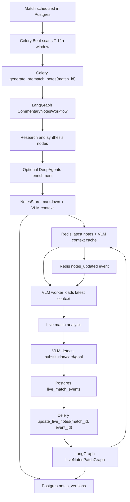

# Production Notes + Live VLM Loop Vertical Slice Plan

This plan captures the production-grade direction for PitchSideAI. The goal is a national/worldwide-ready notes system where Celery provides durable execution, LangGraph provides explicit workflow control, Postgres stores canonical state, Redis keeps hot runtime state, and the VLM loop receives current match context before and during live analysis.

## Product Goal

Generate detailed, structured, source-aware commentary notes 12 hours before kickoff, store and cache them for fast live use, then keep those notes accurate while the match evolves. Major live events such as substitutions, red cards, goals, tactical shifts, and VLM observations should patch only the impacted note sections, publish a new version, and reinject the updated VLM context.

## Architecture



## Core Decisions

- Use Celery for durable scheduling, retries, background execution, and long-running jobs.
- Use LangGraph as the real workflow engine inside Celery tasks, not as documentation-only architecture.
- Use DeepAgents inside selected LangGraph nodes for higher-quality research/synthesis when enabled.
- Use Postgres as the canonical source for match schedules, jobs, live events, notes versions, and final notes.
- Use Redis for Celery broker/result backend, progress events, hot VLM context cache, live update pub/sub, and short-lived locks.
- Treat every notes update as versioned. Failed patches must not replace the active notes version.

## Data Ownership

Postgres is responsible for:
- Match schedule metadata: teams, venue, kickoff, sport, status.
- Notes jobs: status, attempts, idempotency key, last error.
- Notes results: markdown, structured JSON, VLM context JSON.
- Notes versions: canonical active/history versions per match.
- Live events: source, type, timestamp, confidence, payload, processed status.

Redis is responsible for:
- Celery broker/result backend.
- SSE progress events for Notes Hub.
- Latest `NotesStore` cache by `match_id`.
- Latest VLM-ready context cache by `match_id`.
- `notes_updated` pub/sub events for live VLM reinjection.
- Short-lived generation/patch locks.

## Vertical Slice Stories

### Story 1: Scheduled Pre-Match Notes Job

User story: As a producer/fan system, I want commentary notes generated automatically 12 hours before kickoff so detailed match intelligence is ready before the live broadcast.

Implementation:
- Add match scheduling state in Postgres: kickoff time, teams, venue, sport, notes job status.
- Add Celery Beat scheduler that scans for matches entering the T-12h window.
- Enqueue `generate_prematch_notes(match_id)`.
- Run LangGraph as the workflow engine inside the Celery task.
- Publish job progress through Redis.
- Store final notes in Postgres.

Acceptance criteria:
- A scheduled match automatically creates one notes job 12 hours before kickoff.
- Duplicate jobs are prevented.
- Job status is visible through existing notes job endpoints.
- Failed jobs are retried safely.

Code map:
- `models/notes_jobs.py`
- `jobs/celery_app.py`
- `jobs/notes_tasks.py`
- `workflows/commentary_notes_workflow.py`
- `api/server.py`

### Story 2: High-Quality Deep Notes Generation

User story: As a commentator or fan, I want rich, structured, precise notes so the AI has useful context instead of shallow generic commentary.

Implementation:
- Add DeepAgents inside LangGraph research/synthesis nodes.
- Generate structured sections: squads, form, player profiles, tactical themes, storylines, weather, news, risks, key matchups.
- Add deterministic fact-validation and quality-report nodes.
- Track source provenance and confidence per section.
- Output human-readable markdown and VLM-ready structured context.

Acceptance criteria:
- Notes are significantly more detailed than current output.
- Every factual section includes source/provenance metadata.
- Source failures continue the workflow with warnings.
- Final result includes `NotesStore` JSON and markdown.

Code map:
- `agents/deep_notes_agent.py`
- `agents/specialized_commentary/note_organizer_agent.py`
- `workflows/commentary_notes_workflow.py`
- `quality/notes_quality.py`

### Story 3: Notes Storage, Cache, and VLM Context

User story: As the live AI system, I want notes stored durably and cached hot so VLM workers can load them quickly during live analysis.

Implementation:
- Store canonical notes and versions in Postgres.
- Cache latest `NotesStore` in Redis by `match_id`.
- Cache VLM-ready condensed context separately.
- Add `notes_version` and `vlm_context_version`.
- Add API/helper for VLM workers to fetch latest context.

Acceptance criteria:
- Redis cache can be rebuilt from Postgres.
- VLM workers can load latest notes without recomputing them.
- Notes version is returned with every VLM context fetch.
- Cache misses fall back to Postgres.

Code map:
- `models/notes_jobs.py`
- `jobs/notes_cache.py`
- `api/server.py`

### Story 4: Live Event Notes Patch Loop

User story: As the match evolves, I want notes updated after major events so commentary remains accurate after substitutions, red cards, goals, and tactical shifts.

Implementation:
- Add live event ingestion model: source, event type, timestamp, confidence, payload.
- Add Celery `update_live_notes(match_id, event_id)`.
- Run `LiveNotesPatchGraph` in LangGraph.
- Patch only impacted note sections.
- Validate patch and persist a new notes version.
- Publish `notes_updated` through Redis.

Acceptance criteria:
- A substitution updates player, tactical, and matchup sections.
- A red card updates formation/tactical risk sections.
- Previous notes version remains available.
- Failed patches do not replace the active notes.

Code map:
- `workflows/live_notes_patch_workflow.py`
- `jobs/notes_tasks.py`
- `models/notes_jobs.py`
- `api/server.py`

### Story 5: VLM Notes Injection and Reinjection

User story: As the VLM pipeline, I want the latest notes injected before analysis and refreshed when notes change.

Implementation:
- Load latest VLM context before live analysis starts.
- Track active `vlm_context_version`.
- Subscribe to Redis `notes_updated` events.
- Reinjection occurs when a newer version is available.
- VLM observations can trigger live note patch jobs.

Acceptance criteria:
- VLM starts with pre-match notes.
- VLM receives updated context after live notes patches.
- If VLM detects a substitution, a notes patch job is created.
- Reinjection is idempotent and version-aware.

Code map:
- `api/server.py`
- `jobs/notes_cache.py`
- `frontend/src/contexts/LiveSessionContext.jsx`

### Story 6: Production Fault Tolerance

User story: As an operator, I want notes generation and live patching to recover from partial failures without losing match state.

Implementation:
- Add job attempts and idempotency keys.
- Use Redis locks around active notes generation/patching.
- Add Postgres job recovery query for stuck jobs.
- Add retry policy per Celery task type.
- Add structured error/warning reporting.

Acceptance criteria:
- Worker crash leaves recoverable job state.
- Duplicate live events do not create duplicate patches.
- Source failures produce warnings, not total failure.
- Operators can see job status and last error.

Code map:
- `jobs/notes_tasks.py`
- `jobs/notes_cache.py`
- `models/notes_jobs.py`
- `api/server.py`

### Story 7: Frontend Notes Status and Version Visibility

User story: As a user/operator, I want to see when notes are generating, ready, updated, or degraded.

Implementation:
- Update Notes Hub to show scheduled, running, ready, failed, and live-updated states.
- Display notes version and last update event.
- Show warnings for missing/free-source data.
- Keep SSE progress stream connected to Redis events.

Acceptance criteria:
- UI shows pre-match generation progress.
- UI shows when live notes are patched.
- UI exposes degraded/fallback status.
- Playwright validates ready, failed, and updated states.

Code map:
- `frontend/src/pages/NotesGenerationHub.jsx`
- `frontend/src/contexts/LiveSessionContext.jsx`

### Story 8: Quality Evaluation and Regression Suite

User story: As the product owner, I want measurable quality improvements so framework changes actually improve commentary notes.

Implementation:
- Create golden match fixtures.
- Compare current workflow, LangGraph-only, and LangGraph plus DeepAgents outputs.
- Score factuality, structure, tactical depth, precision, and hallucination risk.
- Add regression tests for substitutions, red cards, and goals.

Acceptance criteria:
- Quality evals run locally and in CI.
- DeepAgents workflow beats baseline on the agreed scoring rubric.
- Hallucinated facts are flagged.
- Live patches are tested against known event scenarios.

Code map:
- `quality/notes_quality.py`
- `agents/__tests__/test_notes_quality.py`
- `agents/__tests__/test_live_notes_patch_workflow.py`
- future: `quality/fixtures/`

## Current Handoff State

Status update, June 5, 2026:
- The `NewsAgent(search_service=None)` regression was fixed so explicit `None` disables web-search fallback in tests and fixture-scoped validation. This prevents unrelated Tavily/news items from leaking into accepted team-news evidence when a test or caller intentionally supplies only structured retriever data.
- The targeted evidence regression is covered by `agents/__tests__/test_commentary_notes_quality_gates.py::test_news_agent_filters_polluted_espn_headlines_before_llm`.
- The main remaining architecture gaps are still the live VLM context reinjection loop and section-aware live notes patching.

The current working tree contains an implementation of the main backend/data/LLM pieces for the slice:
- Scheduled match storage and Celery Beat dispatch.
- LangGraph-based pre-match notes workflow.
- Optional DeepAgents enrichment.
- Notes versioning and VLM context payloads.
- Redis cache/pub-sub helpers.
- Live event ingestion and live notes patch workflow.
- Notes Hub version/status visibility.
- Quality and live patch regression tests.

The frontend dependency install was attempted after adding a Linux Node runtime under `/tmp`, but `npm ci` produced an npm internal exit-handler error and did not install runnable local binaries. Python/backend validation is green.

## Validation Commands

Use these commands from the repo root:

```bash
source .venv/bin/activate
python -m pytest -p no:rerunfailures agents/__tests__ tests/models/test_notes_store.py tests/models/test_live_agent.py -q
python -m pytest -p no:rerunfailures --capture=no agents/__tests__/test_commentary_notes_quality_gates.py::test_news_agent_filters_polluted_espn_headlines_before_llm -q
python -m py_compile agents/deep_notes_agent.py agents/qa_agent.py agents/specialized_commentary/note_organizer_agent.py api/server.py jobs/celery_app.py jobs/notes_cache.py jobs/notes_tasks.py models/notes_jobs.py quality/notes_quality.py workflows/commentary_notes_workflow.py workflows/live_notes_patch_workflow.py
git diff --check
```

Observed backend result:

```text
132 passed, 7 warnings
```

Frontend commands once Linux Node/npm is working:

```bash
cd frontend
npm ci
npm run type-check
npm run lint
npm run test -- --runInBand
```

## Production Runbook

Local services:

```bash
docker compose up postgres redis notes-worker notes-scheduler
python -m uvicorn api.server:app --reload --port 8000
```

Schedule a match:

```bash
curl -X POST http://localhost:8000/api/v1/matches/schedule \
  -H "Content-Type: application/json" \
  -d '{
    "home_team": "Arsenal",
    "away_team": "Liverpool",
    "sport": "soccer",
    "venue": "Emirates Stadium",
    "kickoff_at": "2026-05-22T20:00:00Z"
  }'
```

Fetch latest VLM context:

```bash
curl http://localhost:8000/api/v1/matches/{match_id}/vlm-context
```

Ingest a live event:

```bash
curl -X POST http://localhost:8000/api/v1/matches/{match_id}/events \
  -H "Content-Type: application/json" \
  -d '{
    "source": "vlm",
    "event_type": "substitution",
    "confidence": 0.91,
    "description": "Substitution detected: player leaving, replacement entering",
    "payload": {
      "team": "Arsenal",
      "player_off": "Player A",
      "player_on": "Player B"
    }
  }'
```

## Next Codex CLI Tasks

1. Close the live VLM context loop: load `/api/v1/matches/{match_id}/vlm-context` before analysis, track `vlm_context_version`, subscribe to Redis `notes_updated`, and ignore stale updates.
2. Make `LiveNotesPatchWorkflow` section-aware instead of append-only: substitutions should update lineup/player/tactical sections, red cards should update tactical risk, and goals should update storylines/match dynamics.
3. Verify frontend with a working Linux Node runtime.
4. Add Playwright coverage for Notes Hub scheduled, failed, ready, and live-updated states.
5. Add Postgres integration tests for duplicate schedule/job prevention and version fallback.
6. Add Redis integration tests for cache rebuild and `notes_updated` pub/sub.
7. Add a fixture-based quality evaluation suite under `quality/fixtures/`.
8. Decide whether DeepAgents should default off in production until enough evals prove quality gains.
